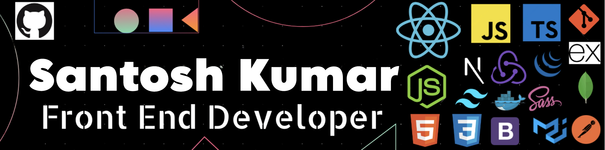

 <h1 align='center'>

</h1>
<h3 align='center'>
  A passionate Frontend Developer from India 
</h3>

  

 

 

🔭 I’m currently working on **Product Dashboard Project** using React.js, Next.js, Javascript, TypeScript, Redux-Saga, Optimization, Webpack, Docker, Kubernetes and Tailwind 

🏫 I’m currently learning **MERN Full Stack Development**

🔎 I’m actively looking to collaborate on **Open source Project**

💬 Ask me about **Frontend Development, Problem Solving and  MERN Full Stack Development**

💗 Love to talk about **Research and Innovation!**

## 🔰 Let's Connect:

  
  

   

## ♨ Languages and Tools:

## 🏆 Achievement

- **Winner of Mr consistent - Jan 2023**: Won this award at classplus for Lead Conversion Rate
- **Winner of Rockstar Rookie - Sep 2023**: Won this award at classplus for fastest delevery
- **Winner of Ace member - March 2024**: Winner Of ace team member award

📫 Feel free to reach out if you have any opportunity that fits my background: **santoshanimesh76.sk@gmail.com**

## 💪 Passionate about Competitive Coding

- Solved 150+ DSA Problems at **LeetCode** using Javascript.
- 4 Star in Problem solving at **HackerRank**

## 🏆 Trophies:

##  Popular Repository:

 

##  Github Stats:

